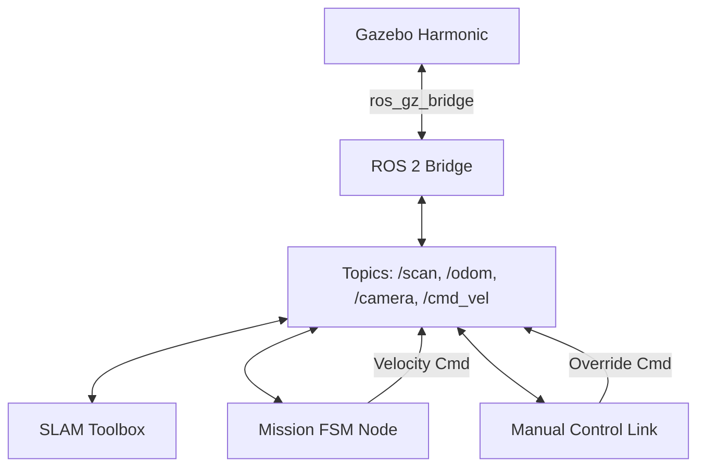

# Master Context Plan (MCP) - Autonomous Drone Project

**Date:** February 20, 2026
**Project Root:** `/home/kunal/Desktop/drone`
**OS:** Linux (Ubuntu 24.04)
**ROS Distro:** ROS 2 Jazzy
**Simulator:** Gazebo Harmonic

---

## 1. Project Overview
This project builds a ROS 2 Jazzy drone stack capable of autonomous arena missions. The system is designed to run in Gazebo Harmonic simulation and deploy to a Raspberry Pi 5 + Pixhawk hardware setup.

**Core Mission Objectives:**
1.  **Autonomous Takeoff**: Climb to safety altitude (3.0m - 4.0m).
2.  **Mapping & Search**: Navigate an arena, avoiding yellow boundaries and obstacles using LiDAR and cameras.
3.  **SLAM**: Generate a 2D map of the environment using `slam_toolbox`.
4.  **RTL & Docking**: Return to launch on low battery (<= 30%) or mission completion.
5.  **Data Sync**: Automatically transfer collected data to a base station upon landing.

---

## 2. System Architecture

The system follows a modular ROS 2 architecture:



-   **Simulation**: `worlds/arena.sdf` (Mars-like terrain with yellow boundaries).
-   **Drone Model**: `px4_x500_lidar_rgb` (equipped with 360° LiDAR, RGB Belly & Front Cameras).
-   **Control Logic**: Python-based Finite State Machine (FSM) handling mission states.
-   **Mapping**: `slam_toolbox` (async mode) for occupancy grid generation.

---

## 3. Environment Setup

### Prerequisites
-   Ubuntu 24.04 LTS
-   ROS 2 Jazzy (`ros-jazzy-desktop`)
-   Gazebo Harmonic (`gz-harmonic`)

### Installation
```bash
# 1. Clone Repository
cd ~/Desktop && git clone https://github.com/kunalz06/DRONE.git drone

# 2. Install Dependencies
sudo apt update && sudo apt install -y 
  ros-jazzy-ros-gz-bridge ros-jazzy-slam-toolbox ros-jazzy-nav2-map-server 
  ros-jazzy-cv-bridge ros-jazzy-actuator-msgs python3-opencv python3-numpy

# 3. Source Environment
source /opt/ros/jazzy/setup.bash
```

---

## 4. Operational Workflows

### A. Run Simulation & Autonomous Mission
**Terminal 1 (Simulation):**
```bash
cd ~/Desktop/drone
HOME=/tmp gz sim -r worlds/arena.sdf
```
**Terminal 2 (Mission Logic + SLAM):**
```bash
cd ~/Desktop/drone
source /opt/ros/jazzy/setup.bash
HOME=/tmp ros2 launch launch/slam_arena_mission.launch.py
```
*   **Behavior**: Drone takes off, maps the area, avoids boundaries, and generates a map in RViz.

### B. Manual Control Override
Allows operator to take over control at any time.

**Terminal 3 (Operator):**
```bash
cd ~/Desktop/drone
source /opt/ros/jazzy/setup.bash
python3 scripts/manual_control_link.py
```
*   **Controls**: `m` (Enable Manual), `n` (Disable/Return to Auto), `w/s/a/d` (Move), `i/k` (Up/Down), `j/l` (Yaw).

### C. Map Saving
Save the generated map during or after the mission.
```bash
mkdir -p maps
ros2 run nav2_map_server map_saver_cli -f maps/arena_map --ros-args -p map_subscribe_transient_local:=true
```

---

## 5. Development Roadmap (Execution Plan)

### Phase 1: Simulation & Base System (Current Status: **Active**)
- [x] Setup Ubuntu/ROS 2/Gazebo environment.
- [x] Create Arena World (`worlds/arena.sdf`).
- [x] Implement Basic Control Script (`fly_takeoff_hover_land.py`).
- [x] Implement SLAM & Boundary Mapping (`slam_boundary_mapping_mission.py`).
- [x] Add Manual Control Override (`manual_control_link.py`).

### Phase 2: Advanced Autonomy (Next Steps)
- [ ] Refine FSM States: `WAITING_FOR_CHARGE`, `DOCKING`, `SYNCING`.
- [ ] Improve Boundary Detection (Robust HSV tuning).
- [ ] Implement Precision Landing (ArUco markers).

### Phase 3: Hardware Deployment
- [ ] Setup Raspberry Pi 5 with Ubuntu 24.04 & ROS 2.
- [ ] Bridge MAVROS/MicroXRCE-DDS to Pixhawk.
- [ ] Calibrate Sensors (IMU, Mag).
- [ ] Field Tests.

---

## 6. File Structure & Key Files

| Directory | File | Description |
| :--- | :--- | :--- |
| **root** | `MCP.md` | **This Master Context Plan.** |
| | `execution_plan.md` | Detailed development phases. |
| **launch/** | `slam_arena_mission.launch.py` | Main launch file for Sim + SLAM + Mission. |
| **scripts/** | `slam_boundary_mapping_mission.py` | Core autonomous logic (FSM). |
| | `manual_control_link.py` | Keyboard teleop node. |
| | `fly_takeoff_hover_land.py` | Simple test script for flight dynamics. |
| **worlds/** | `arena.sdf` | Simulation environment. |
| **config/** | `arena_bridge_topics.yaml` | ROS-GZ Bridge configuration. |
| | `slam_toolbox_arena.yaml` | SLAM Toolbox settings. |

---

## 7. Troubleshooting

-   **Missing Packages**: Run `sudo apt install ros-jazzy-ros-gz-bridge ros-jazzy-slam-toolbox`.
-   **No Map in RViz**: Ensure Gazebo is running *before* the launch file. Check `use_sim_time` is true.
-   **Scripts Permission Denied**: Run `chmod +x scripts/*.py launch/*.py`.
-   **Network/Bridge Issues**: Check `ros2 topic list` to see if `/scan` and `/odom` are present.

